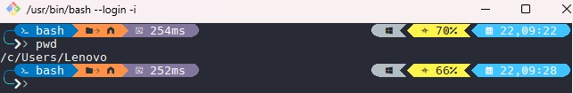
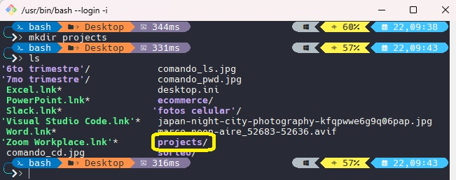
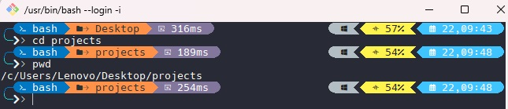
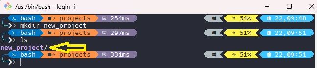
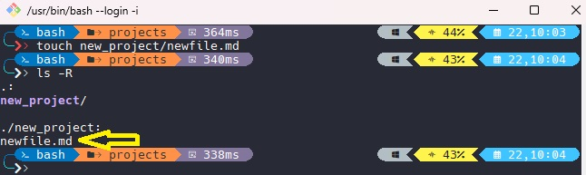
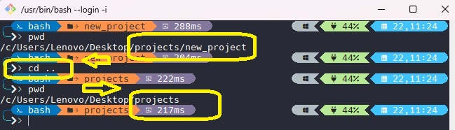
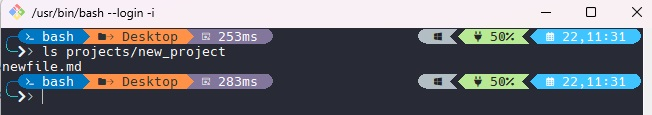
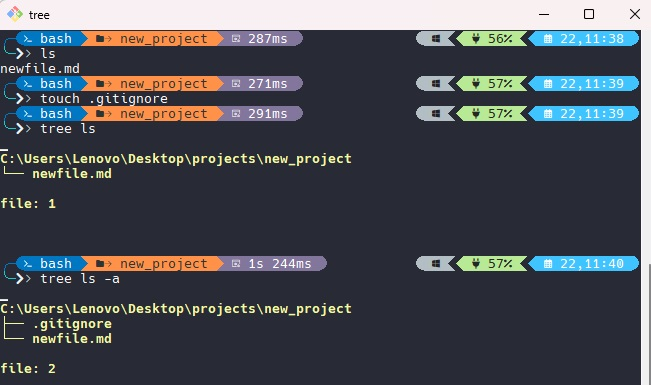

# Probando comandos en la terminal GIT BASH del READ 06

✔️ ***Comando `pwd`*** \

✔️ ***Comando `cd`*** \
 \
Nos movemos al directorio "Desktop" y luego verificamos que estemos dentro de dicho directorio

✔️ ***Comando `ls`*** \

✔️ ***Comando `mkdir`*** \
 \
Creando el directorio ***"projects"*** y verificando que este creado

✔️ ***Comando `cd projects`*** \
 \
Moviendonos al directorio ***"projects"*** y verificando que estemos dentro del directorio.

✔️ ***Comando `mkdir new-project`*** \
 \
Creando un nuevo directorio ***"new_project"**** y verificando que se haya creado.

✔️ ***Comando `touch new-project/newfile.md`*** \
 \
Creando un nuevo archivo vacio ***"newfile.md"*** y verificando que se haya creado.

✔️ ***Comando `cd ..`*** \
 \
primero ubicamos la ruta actual, y luego de ejecutar el comando ***"cd .."*** subimos un directorio por encima del actual. Procedemos a verifar que estemos en el directorio deseado.

✔️ ***Comando `ls projects/new-project`*** \
 \
Listamos los archivos y directorios en la ruta ***"projects/new-project"***

✔️ ***Comando `ls -a`*** \
 \
Primero listamos todos los archivos dentro del directorio ***"new_project"***, Luego creamos un archivo oculto ***".gitignore"***. Listamos los archivos dentro de ***"new_project"*** y verificamos que no se muestra el alrchivo ***".gitignore"***. Aplicando el comando ***"ls -a"*** y podemos ver los archivos incluido el archi oculto ***".gitignore"***.

🏠 [***Regresar***](./README.md)
