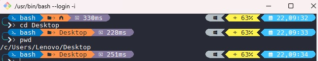
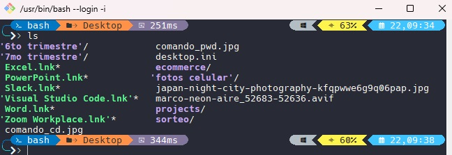

# Probando comandos en la terminal GIT BASH del READ 06

✔️ ***Comando `pwd`***

✔️ ***Comando `cd`*** 

Nos movemos al directorio "Desktop" y luego verificamos que estemos dentro de dicho directorio

✔️ ***Comando `ls`***

✔️ ***Comando `mkdir`***

Creando el directorio "projects" y verificando que este creado

✔️ ***Comando `cd projects`***

Moviendonos al directorio "projects" y verificando que estemos dentro del directorio.

✔️ ***Comando `mkdir new-project`***

Creando un nuevo directorio "new_project"y verificando que se haya creado.

✔️ ***Comando `touch new-project/newfile.md`***

✔️ ***Comando `cd ..`***
✔️ ***Comando `ls projects/new-project`***
✔️ ***Comando `ls -a`***
✔️ ***Comando `ls -a RutaDirectorio`***
